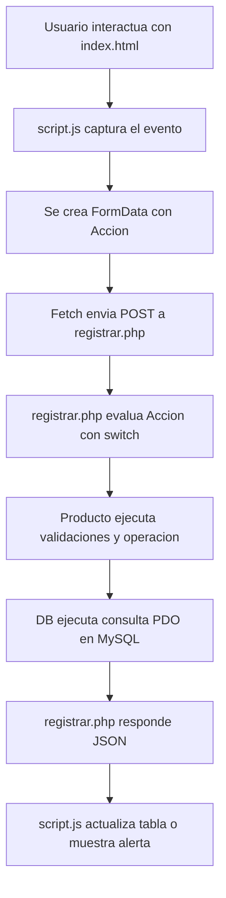

# Documentacion del Proyecto CRUD Productos

## 1. Descripcion general

Este proyecto es una aplicacion web CRUD para administrar productos. Permite registrar, listar, buscar, modificar y eliminar productos desde una interfaz web construida con HTML, Bootstrap, JavaScript, PHP y MySQL.

La logica principal del sistema se trabaja con una sola entrada hacia el servidor: el archivo `registrar.php`. Desde JavaScript se envia una accion por medio de `FormData` y el controlador PHP decide que operacion ejecutar usando `switch`.

El proyecto esta pensado para ejecutarse en XAMPP, usando Apache como servidor web y MySQL como gestor de base de datos.

## 2. Tecnologias utilizadas

- HTML5: estructura de la interfaz.
- CSS3: estilos personalizados del sistema.
- Bootstrap 5: componentes visuales y sistema responsive.
- Bootstrap Icons: iconos de botones y titulos.
- SweetAlert2: alertas, confirmaciones y mensajes de carga.
- JavaScript: logica del cliente y consumo del backend con Fetch API.
- PHP: controlador y modelo del sistema.
- PDO: conexion segura con MySQL usando consultas preparadas.
- MySQL: almacenamiento de productos.

## 3. Estructura del proyecto

```text
LaboratorioCRUD/
├── index.html
├── registrar.php
├── css/
│   └── estilos.css
├── js/
│   └── script.js
└── Modelo/
    ├── conexion.php
    └── Productos.php
```

## 4. Responsabilidad de cada archivo

### `index.html`

Contiene la interfaz principal del CRUD.

Incluye:

- Formulario para registrar o modificar productos.
- Campo oculto `id`, usado para saber si el formulario esta en modo registro o edicion.
- Buscador por codigo o nombre.
- Tabla donde se muestran los productos.
- Referencias a Bootstrap, Bootstrap Icons, SweetAlert2, el archivo CSS y el archivo JavaScript.

### `css/estilos.css`

Contiene los estilos propios del proyecto.

Define:

- Paleta de colores oscura.
- Estilo de tarjetas, formularios, botones y tabla.
- Estados visuales de botones.
- Ajustes responsive para pantallas medianas y pequenas.
- Estilos personalizados para SweetAlert2.

### `js/script.js`

Contiene la logica del frontend.

Se encarga de:

- Cargar los productos al abrir la pagina.
- Validar el formulario antes de enviar datos.
- Decidir si se debe guardar o modificar un producto.
- Enviar peticiones al servidor con Fetch API.
- Procesar respuestas JSON.
- Renderizar la tabla de productos.
- Buscar productos mientras el usuario escribe.
- Cargar datos en el formulario para editar.
- Confirmar eliminaciones con SweetAlert2.
- Limpiar el formulario y volver al modo registro.

### `registrar.php`

Funciona como controlador principal del sistema.

Recibe todas las solicitudes del frontend mediante metodo `POST` y responde siempre en formato JSON.

La accion se recibe en el campo `Accion` y se procesa con un `switch`.

Acciones soportadas:

- `Guardar`: registra un nuevo producto.
- `Modificar`: actualiza un producto existente.
- `Listar`: obtiene todos los productos.
- `Buscar`: filtra productos por codigo o nombre.
- `Eliminar`: elimina un producto por su ID.
- `Obtener`: consulta un producto especifico para cargarlo en el formulario de edicion.

### `Modelo/conexion.php`

Contiene la clase `DB`, responsable de la conexion a MySQL.

Su logica se basa en:

- Usar PDO para conectarse a la base de datos.
- Aplicar el patron Singleton para reutilizar una sola conexion durante la peticion.
- Ejecutar consultas preparadas.
- Separar metodos segun el tipo de operacion:
  - `query()`: consultas `SELECT`.
  - `insertSeguro()`: consultas `INSERT`.
  - `updateSeguro()`: consultas `UPDATE`.
  - `deleteSeguro()`: consultas `DELETE`.

### `Modelo/Productos.php`

Contiene la clase `Producto`, que representa el modelo principal del sistema.

Se encarga de:

- Guardar las propiedades del producto.
- Recibir y limpiar datos por medio de setters.
- Validar codigo, nombre, precio y cantidad.
- Verificar si un codigo ya existe.
- Insertar productos.
- Actualizar productos.
- Eliminar productos.
- Buscar productos.
- Listar todos los productos.
- Obtener un producto por ID.

## 5. Base de datos

El proyecto espera una base de datos llamada `productosdb` y una tabla llamada `productos`.

SQL sugerido:

```sql
CREATE DATABASE IF NOT EXISTS productosdb
CHARACTER SET utf8mb4
COLLATE utf8mb4_unicode_ci;

USE productosdb;

CREATE TABLE IF NOT EXISTS productos (
    id INT AUTO_INCREMENT PRIMARY KEY,
    codigo VARCHAR(20) NOT NULL UNIQUE,
    producto VARCHAR(100) NOT NULL,
    precio DECIMAL(10,2) NOT NULL,
    cantidad INT NOT NULL
);
```

Campos de la tabla:

| Campo | Tipo | Descripcion |
| --- | --- | --- |
| `id` | `INT AUTO_INCREMENT` | Identificador unico del producto. |
| `codigo` | `VARCHAR(20)` | Codigo del producto. No debe repetirse. |
| `producto` | `VARCHAR(100)` | Nombre del producto. |
| `precio` | `DECIMAL(10,2)` | Precio del producto. Debe ser mayor que cero. |
| `cantidad` | `INT` | Cantidad disponible. |

## 6. Flujo general del sistema



## 7. Logica CRUD por accion

### Guardar

1. El usuario llena el formulario.
2. `script.js` detecta que el campo oculto `id` esta vacio.
3. Se asigna `Accion = "Guardar"`.
4. Se validan los datos en el navegador.
5. Se envia la informacion a `registrar.php`.
6. PHP crea un objeto `Producto`.
7. Se asignan codigo, producto, precio y cantidad.
8. Se valida nuevamente en el servidor.
9. Se verifica que el codigo no exista.
10. Se inserta el producto en MySQL.
11. El servidor responde JSON.
12. JavaScript muestra una alerta y actualiza la tabla.

### Modificar

1. El usuario presiona el boton editar.
2. JavaScript solicita el producto con `Accion = "Obtener"`.
3. El servidor devuelve los datos del producto.
4. El formulario se llena con los datos recibidos.
5. El boton cambia de `Registrar` a `Actualizar`.
6. Al enviar el formulario, JavaScript detecta que existe un `id`.
7. Se asigna `Accion = "Modificar"`.
8. El servidor valida los datos.
9. Se verifica que el codigo no pertenezca a otro producto.
10. Se actualiza el registro en la base de datos.
11. Se limpia el formulario y se actualiza la tabla.

### Listar

1. Al cargar la pagina se ejecuta `ListarProductos()`.
2. JavaScript envia `Accion = "Listar"`.
3. PHP consulta todos los productos.
4. Los productos se ordenan por `id` de forma descendente.
5. JavaScript renderiza las filas de la tabla.

### Buscar

1. El usuario escribe en el buscador.
2. JavaScript espera 350 milisegundos para evitar demasiadas consultas.
3. Se envia `Accion = "Buscar"` junto con el termino.
4. PHP busca coincidencias en `codigo` o `producto`.
5. JavaScript muestra los resultados encontrados.
6. Si el campo de busqueda queda vacio, se vuelve a listar todo.

### Eliminar

1. El usuario presiona el boton eliminar.
2. SweetAlert2 muestra una confirmacion.
3. Si el usuario confirma, JavaScript envia `Accion = "Eliminar"` y el `id`.
4. PHP valida que el ID sea correcto.
5. Se elimina el producto en MySQL.
6. El servidor devuelve el resultado.
7. JavaScript muestra una alerta y refresca la tabla.

### Obtener

1. Se usa cuando el usuario quiere editar un producto.
2. JavaScript envia el `id` del producto.
3. PHP consulta el producto por ID.
4. Si existe, devuelve sus datos.
5. JavaScript carga esos datos en el formulario.

## 8. Validaciones del sistema

El sistema valida datos tanto en el frontend como en el backend.

Validaciones principales:

| Campo | Regla |
| --- | --- |
| `codigo` | Obligatorio y maximo 20 caracteres. |
| `producto` | Obligatorio y maximo 100 caracteres. |
| `precio` | Obligatorio, numerico y mayor que cero. |
| `cantidad` | Obligatoria y numerica. |
| `cantidad` al guardar | Debe ser minimo 1. |
| `cantidad` al modificar | Puede ser 0, pero no negativa. |
| `codigo` | No puede repetirse en otro producto. |

La validacion del frontend mejora la experiencia del usuario, pero la validacion importante se mantiene en PHP para proteger la base de datos.

## 9. Respuestas JSON del backend

Todas las respuestas del servidor tienen una estructura comun.

Respuesta exitosa:

```json
{
    "success": true,
    "message": "Producto registrado correctamente.",
    "accion": "Guardar"
}
```

Respuesta con error:

```json
{
    "success": false,
    "message": "Errores de validacion.",
    "errors": [
        "Debe ingresar el codigo."
    ],
    "accion": "Guardar"
}
```

Esta estructura permite que `script.js` maneje todas las respuestas de forma ordenada.

## 10. Endpoints internos

Aunque el proyecto no usa rutas REST separadas, `registrar.php` funciona como endpoint unico.

| Accion | Metodo | Archivo | Descripcion |
| --- | --- | --- | --- |
| `Guardar` | `POST` | `registrar.php` | Registra un producto. |
| `Modificar` | `POST` | `registrar.php` | Actualiza un producto. |
| `Listar` | `POST` | `registrar.php` | Lista todos los productos. |
| `Buscar` | `POST` | `registrar.php` | Busca por codigo o nombre. |
| `Eliminar` | `POST` | `registrar.php` | Elimina por ID. |
| `Obtener` | `POST` | `registrar.php` | Obtiene un producto por ID. |

## 11. Seguridad aplicada

El proyecto aplica varias medidas basicas de seguridad:

- Uso de consultas preparadas con PDO.
- Separacion entre controlador, modelo y conexion.
- Validacion de datos en cliente y servidor.
- Limpieza de textos recibidos con `trim()` y `htmlspecialchars()`.
- Escape de datos antes de insertarlos en la tabla HTML con `escapeHTML()`.
- Respuestas JSON controladas desde la funcion `responder()`.

## 12. Como ejecutar el proyecto

1. Copiar la carpeta `LaboratorioCRUD` dentro de `C:\xampp\htdocs\`.
2. Abrir XAMPP.
3. Iniciar Apache.
4. Iniciar MySQL.
5. Crear la base de datos `productosdb`.
6. Crear la tabla `productos` usando el SQL de esta documentacion.
7. Abrir el navegador en:

```text
http://localhost/LaboratorioCRUD/
```

## 13. Pruebas manuales recomendadas

### Registro

- Registrar un producto con datos validos.
- Intentar registrar un producto sin codigo.
- Intentar registrar un producto con precio 0.
- Intentar registrar un producto con codigo repetido.

### Listado

- Verificar que los productos aparezcan en la tabla.
- Confirmar que el ultimo producto registrado aparezca primero.

### Busqueda

- Buscar por codigo.
- Buscar por nombre.
- Vaciar el buscador y verificar que se listen todos los productos.

### Modificacion

- Editar un producto existente.
- Cambiar precio y cantidad.
- Dejar cantidad en 0 para verificar que se permita en edicion.
- Intentar usar un codigo que ya pertenece a otro producto.

### Eliminacion

- Cancelar una eliminacion.
- Confirmar una eliminacion.
- Verificar que el producto desaparezca de la tabla.

## 14. Logica de trabajo usada en el proyecto

La logica del proyecto se basa en mantener un flujo simple y ordenado:

1. La interfaz no recarga la pagina.
2. JavaScript captura las acciones del usuario.
3. Cada accion se envia con el campo `Accion`.
4. PHP centraliza las operaciones en `registrar.php`.
5. El modelo `Producto` contiene la logica de productos.
6. La clase `DB` se encarga solamente de la base de datos.
7. El servidor responde JSON.
8. JavaScript actualiza la interfaz segun la respuesta.

Este estilo permite que el CRUD sea facil de leer, mantener y ampliar.

## 15. Posibles mejoras futuras

- Agregar paginacion a la tabla.
- Agregar control de usuarios y sesiones.
- Separar las rutas en archivos o controladores especificos.
- Agregar fecha de creacion y fecha de actualizacion.
- Implementar exportacion a Excel o PDF.
- Agregar pruebas automatizadas.
- Mover credenciales de base de datos a un archivo de configuracion.

